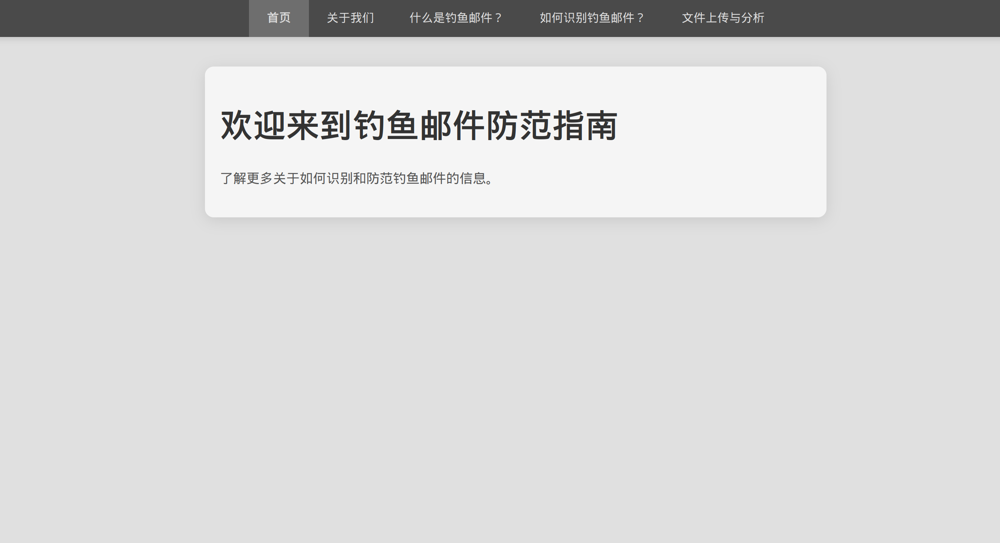
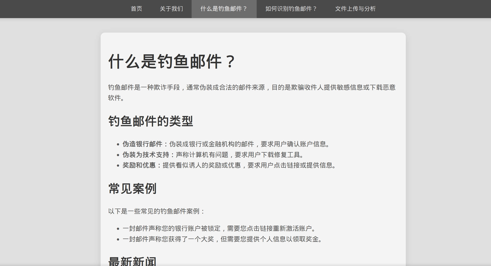
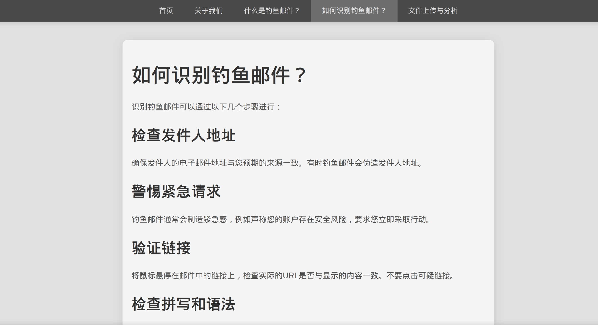
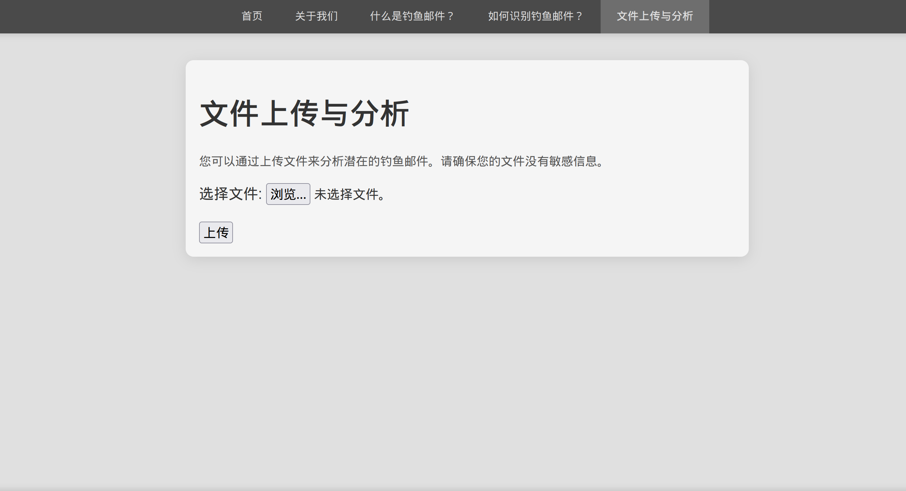

# 钓鱼邮件防范指南

欢迎访问钓鱼邮件防范指南的项目页面！本项目旨在帮助用户识别钓鱼邮件并提供防范措施。

## 项目概述

本项目包括以下几个主要功能：
- 识别钓鱼邮件
- 提供防范钓鱼邮件的建议
- 上传文件并分析内容

## 项目结构

- `index.html`：首页，介绍了钓鱼邮件的基本信息。
- `about.html`：关于我们，提供项目背景和联系信息。
- `phishing-info.html`：详细解释什么是钓鱼邮件。
- `detection.html`：如何识别钓鱼邮件的详细指南。
- `upload.html`：文件上传与分析界面。

## 图片展示

以下是一些示例图片展示：







## 如何使用

1. 打开 `index.html` 页面，了解钓鱼邮件的基本信息。
2. 使用 `upload.html` 页面上传文件进行分析。
3. 查看 `detection.html` 页面了解如何识别钓鱼邮件。

## 运行项目

请确保您已经安装了所需的依赖项，并按照以下步骤运行项目：

1. 克隆项目仓库：
    ```bash
    git clone <项目仓库URL>
    ```
2. 进入项目目录：
    ```bash
    cd <项目目录>
    ```
3. 启动服务器：
    ```bash
    cargo run
    ```

访问 `http://127.0.0.1:8080` 以查看项目主页。

## 贡献

如果您有任何建议或贡献，请提交 Pull Request 或联系项目维护者。

## 许可

本项目使用 [MIT 许可证](LICENSE) 进行许可。

---

感谢您的访问和使用本项目！
